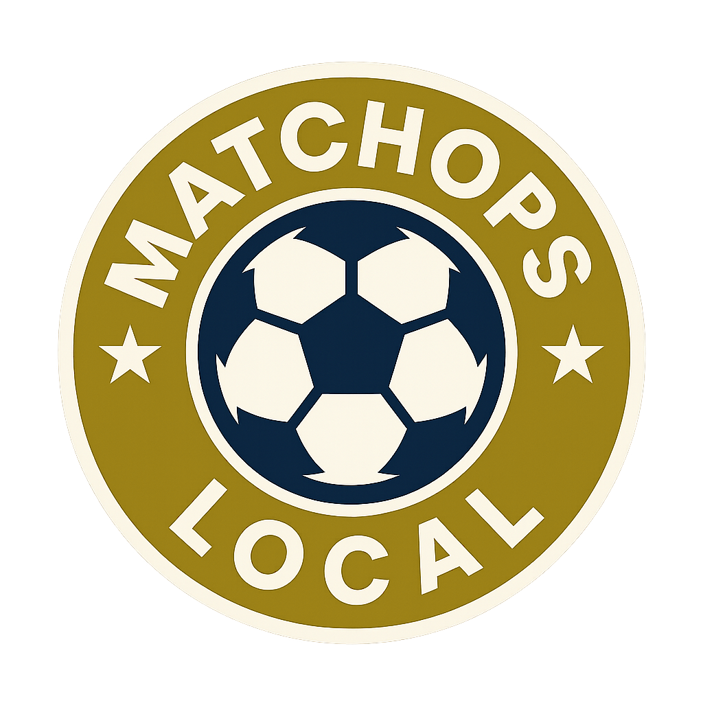

<div align="center">
  
</div>

# MatchOps-Local

**Local-first soccer coaching PWA that keeps every byte of your team data on your device.**

[](LICENSE)
[](https://www.typescriptlang.org/)
[](https://nextjs.org/)
[](https://reactjs.org/)
[](#)
[](https://web.dev/progressive-web-apps/)

MatchOps-Local is built for coaches who need privacy, offline reliability, and soccer-specific workflows without subscriptions or external servers.

- 🔒 All data stays on-device (IndexedDB-first)
- ⚡ Sub-second performance with local caching
- 📴 Full offline + PWA install
- ⚽ Purpose-built for match prep, live tracking, and post-game analysis

---

## Feature Tour

- **Plan**: Personnel pool, multi-team rosters from a master player list, seasons/tournaments with Finnish league presets, bilingual UI (EN/FI).
- **Track**: Interactive field with undo/redo, live game timer with substitution alerts and history, real-time event logging (goals/assists/opponent), tactics board with drawings.
- **Assess**: Per-player stats across games/seasons/tournaments, weighted assessments (technical/tactical/physical/mental), filters by season/tournament/team, backups/import/export.
- **PWA**: Installable, offline-first, wake-lock support, auto-update prompt; HTML served network-first to avoid stale versions, offline fallback page.

## What You Can Do (Highlights)

- **Rosters & Personnel:** Build a master player pool, assemble multiple teams, assign staff roles (coach/physio/manager) per game, and switch rosters quickly.
- **Game Day Control:** Drag-and-drop players on the field, run the live timer with substitution alerts/history, log goals/assists/opponent events, and undo/redo every action.
- **Tactics & Communication:** Sketch plays on the tactics board, toggle between tactical and player views, and keep the screen awake with wake-lock while coaching.
- **Stats & Assessment:** Track appearances/goals/assists/playtime, slice by season/tournament/team, and run structured player assessments with contextual weighting.
- **Seasons & Tournaments:** Organize fixtures by season/tournament, including Finnish league presets, and capture awards/winners.
- **Backup & Recovery:** Export/import full backups or individual games; migrations handle legacy localStorage to IndexedDB with pause/resume/cancel.
- **Accessibility & Localization:** WCAG AA-focused UI with keyboard navigation and ARIA labeling; bilingual EN/FI out of the box.
- **Offline-first PWA:** Install to home screen, run fully offline, and rely on the service worker + offline fallback page for poor connectivity.

---

## Quick Start

**Prereqs:** Node 20.x, npm.

```bash
git clone https://github.com/VillePajala/MatchOps-Local.git
cd MatchOps-Local
npm install
cp .env.example .env.local   # fill in Sentry values if you use error reporting
npm run dev                  # start the app on http://localhost:3000
```

Production build:

```bash
npm run build                # generates manifest, service worker, release-notes
npm run start
```

## Environment & Config

Copy `.env.example` to `.env.local`:
- `NEXT_PUBLIC_SENTRY_DSN`, `SENTRY_*`: optional, for error reporting.
- `NEXT_PUBLIC_ANALYTICS_ENABLED`: toggle analytics (off by default).
- `ANALYZE=true`: enable bundle analyzer during builds.
- `NEXT_PUBLIC_DEBUG` / `NEXT_PUBLIC_DEBUG_ALL`: optional debug flags for local dev.

## Development Workflow

Key scripts:
- `npm run dev` – start Next dev server.
- `npm run lint` / `npm run type-check` – static checks.
- `npm run test:unit` / `npm run test:integration` – unit & integration suites.
- `npm run test:critical` – core workflows (CI gate).
- `npm run test:smoke` – component smoke tests (CI gate).
- `npm run test:a11y` – accessibility suites (covers Privacy Policy, Terms, offline page).
- `npm run test:performance` – perf tests (best-effort in CI).
- `npm run test:ci` – full Jest CI config with reporting.
- `npm run build` – production build (runs manifest + release-notes generators).
- `npm run build:analyze` – `ANALYZE=true` build with bundle analyzer + summary.
- `npm run e2e` – Playwright (opt-in; CI job is off by default).

Reports:
- Jest JUnit: `test-results/results.xml`
- Jest HTML: `test-results/report.html`
- Coverage: `coverage/lcov-report/index.html`
- Playwright: `playwright-report/`

Known test noise: Next.js `Link` triggers a one-time `act(...)` warning in jsdom during a11y tests; allowed by our console filters.

## Quality Gates (P3 Play Store)

- **Accessibility:** `npm run test:a11y` validates static pages (Privacy Policy, Terms) and offline fallback; includes WCAG AA contrast checks.
- **Performance/bundle:** `npm run build:analyze` (ANALYZE=true) produces `.next/analyze`; bundle size summary is reported in CI.
- **Baseline targets:** `docs/06-quality/performance-baseline.md` (LCP < 2.5s, INP < 200ms, CLS < 0.1, TTFB < 800ms; Lighthouse >90 all categories, PWA pass).
- **Critical path CI:** `.github/workflows/test-guards.yml` runs type-check, critical, smoke, performance, a11y, lint, and build on PRs.

## Architecture & Docs

- **Roadmap:** `docs/03-active-plans/UNIFIED-ROADMAP.md` and `docs/03-active-plans/PLAY-STORE-IMPLEMENTATION-PLAN.md`.
- **Architecture:** `docs/02-technical/architecture/` (local-first design), `docs/02-technical/database/` (storage schema), `docs/02-technical/security.md`.
- **Testing:** `docs/06-testing/` (strategy, coverage goals), `docs/06-quality/performance-baseline.md`.
- **Features:** `docs/04-features/` for deeper specs.

## Feature Snapshot

- **Plan:** personnel pool, multi-team rosters, seasons/tournaments, bilingual (EN/FI).
- **Track:** interactive field with undo/redo, live timer with substitution alerts, event logging, tactics board.
- **Assess:** per-player stats across games/seasons/tournaments, assessments with weighted context, backups/import/export.
- **PWA:** installable, offline-first, wake-lock support, auto-update prompt.

## Build & Deploy

- `npm run build` generates `public/manifest.json`, `public/sw.js`, and `public/release-notes.json` (last commit message).
- Deploy `.next` with any static host or run `npm run start` on Node.
- Bundle analyzer output: `.next/analyze/` when `ANALYZE=true`.
- Service worker caches static assets; HTML is network-first to avoid stale app versions. Offline fallback: `public/offline.html`.

## Troubleshooting

- Use Node 20.x; mismatched Node versions can break `npm ci`.
- Sentry is optional; remove `NEXT_PUBLIC_SENTRY_DSN` locally to disable reporting.
- If bundle analysis fails, set `ANALYZE=true` for that build step.
- A11y tests emit a benign React `act(...)` warning from Next `Link`; suite still passes.

## License

All rights reserved © 2025 Ville Pajala. See [LICENSE](LICENSE) for details.

---

**MatchOps-Local: Empowering coaches while protecting young athletes' privacy through local-first technology.**
