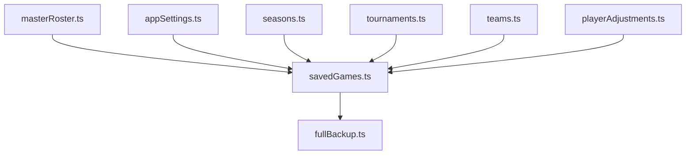

# Phase 2: Utility Refactoring Guide

**⚠️ DOCUMENT SUPERSEDED ⚠️**

**This document describes unnecessary refactoring based on incorrect assumptions.**

**👉 USE THIS INSTEAD: [DOCUMENTATION_AUDIT_RESULTS.md](./DOCUMENTATION_AUDIT_RESULTS.md) (2-4 hour fix)**

---

[← Corrected Plan](./DOCUMENTATION_AUDIT_RESULTS.md) | [Phase 1 Original](./PHASE1_STORAGE_SERVICE.md) | [Original Storage Plan](./STORAGE_INTEGRATION_PLAN.md)

## ~~Overview~~ (ORIGINAL - SUPERSEDED)
This document provides detailed steps for refactoring each utility file to use the new storage service instead of direct localStorage access.

## Refactoring Order & Dependencies



## Utility-by-Utility Refactoring Guide

### 1. masterRoster.ts
**Complexity:** Low
**Dependencies:** None
**Used By:** Many components

#### Current Implementation
```typescript
import { getLocalStorageItem, setLocalStorageItem } from '@/utils/localStorage';

export const getMasterRoster = (): Player[] => {
  const rosterJson = getLocalStorageItem(MASTER_ROSTER_KEY);
  if (!rosterJson) return [];
  return JSON.parse(rosterJson);
};

export const saveMasterRoster = (players: Player[]): boolean => {
  setLocalStorageItem(MASTER_ROSTER_KEY, JSON.stringify(players));
  return true;
};
```

#### Refactored Implementation
```typescript
import { getStorageItem, setStorageItem } from '@/utils/storage';

export const getMasterRoster = async (): Promise<Player[]> => {
  try {
    const rosterJson = await getStorageItem(MASTER_ROSTER_KEY);
    if (!rosterJson) return [];
    return JSON.parse(rosterJson);
  } catch (error) {
    logger.error('Failed to get master roster:', error);
    return [];
  }
};

export const saveMasterRoster = async (players: Player[]): Promise<boolean> => {
  try {
    await setStorageItem(MASTER_ROSTER_KEY, JSON.stringify(players));
    return true;
  } catch (error) {
    logger.error('Failed to save master roster:', error);
    return false;
  }
};
```

#### React Query Updates
```typescript
// Before
useQuery({
  queryKey: [QUERY_KEYS.MASTER_ROSTER],
  queryFn: getMasterRoster
});

// After
useQuery({
  queryKey: [QUERY_KEYS.MASTER_ROSTER],
  queryFn: () => getMasterRoster() // Now returns Promise
});
```

### 2. appSettings.ts
**Complexity:** Medium (has legacy compatibility)
**Dependencies:** None
**Used By:** Many components

#### Current Implementation
```typescript
export const getAppSettings = (): AppSettings => {
  const settingsJson = getLocalStorageItem(APP_SETTINGS_KEY);
  if (!settingsJson) return DEFAULT_APP_SETTINGS;
  return { ...DEFAULT_APP_SETTINGS, ...JSON.parse(settingsJson) };
};

export const saveAppSettings = (settings: AppSettings): boolean => {
  setLocalStorageItem(APP_SETTINGS_KEY, JSON.stringify(settings));
  return true;
};

// Legacy functions
export const getLastHomeTeamName = (): string | null => {
  const legacyValue = getLocalStorageItem(LAST_HOME_TEAM_NAME_KEY);
  if (legacyValue) return legacyValue;
  const settings = getAppSettings();
  return settings.lastHomeTeamName || null;
};
```

#### Refactored Implementation
```typescript
export const getAppSettings = async (): Promise<AppSettings> => {
  try {
    const settingsJson = await getStorageItem(APP_SETTINGS_KEY);
    if (!settingsJson) return DEFAULT_APP_SETTINGS;
    return { ...DEFAULT_APP_SETTINGS, ...JSON.parse(settingsJson) };
  } catch (error) {
    logger.error('Failed to get app settings:', error);
    return DEFAULT_APP_SETTINGS;
  }
};

export const saveAppSettings = async (settings: AppSettings): Promise<boolean> => {
  try {
    await setStorageItem(APP_SETTINGS_KEY, JSON.stringify(settings));
    return true;
  } catch (error) {
    logger.error('Failed to save app settings:', error);
    return false;
  }
};

// Legacy function with migration
export const getLastHomeTeamName = async (): Promise<string | null> => {
  // Check legacy location first for migration
  if (typeof window !== 'undefined' && window.localStorage) {
    const legacyValue = window.localStorage.getItem(LAST_HOME_TEAM_NAME_KEY);
    if (legacyValue) {
      // Migrate to new storage
      await setStorageItem(LAST_HOME_TEAM_NAME_KEY, legacyValue);
      window.localStorage.removeItem(LAST_HOME_TEAM_NAME_KEY);
      return legacyValue;
    }
  }

  const settings = await getAppSettings();
  return settings.lastHomeTeamName || null;
};
```

### 3. savedGames.ts
**Complexity:** High (core functionality)
**Dependencies:** appSettings, masterRoster
**Used By:** Main game components

#### Key Challenges
- Many functions depend on this
- Complex data structures
- Critical for game functionality
- Import/export functionality

#### Current Implementation
```typescript
export const getSavedGames = async (): Promise<SavedGamesCollection> => {
  const gamesJson = getLocalStorageItem(SAVED_GAMES_KEY);
  if (!gamesJson) return {};
  return JSON.parse(gamesJson);
};

export const saveGames = async (games: SavedGamesCollection): Promise<void> => {
  setLocalStorageItem(SAVED_GAMES_KEY, JSON.stringify(games));
};
```

#### Refactored Implementation
```typescript
import { getStorageItem, setStorageItem } from '@/utils/storage';

export const getSavedGames = async (): Promise<SavedGamesCollection> => {
  try {
    const gamesJson = await getStorageItem(SAVED_GAMES_KEY);
    if (!gamesJson) return {};
    return JSON.parse(gamesJson);
  } catch (error) {
    logger.error('Failed to get saved games:', error);
    throw error; // Re-throw as this is critical
  }
};

export const saveGames = async (games: SavedGamesCollection): Promise<void> => {
  try {
    await setStorageItem(SAVED_GAMES_KEY, JSON.stringify(games));
  } catch (error) {
    logger.error('Failed to save games:', error);
    throw error; // Re-throw as this is critical
  }
};

// Import function - CRITICAL for user data
export const importGamesFromJson = async (
  jsonData: string,
  overwrite: boolean = false
): Promise<ImportResult> => {
  // ... validation code ...

  // Now saves to IndexedDB via storage service!
  if (result.successful > 0) {
    await saveGames(gamesToSave); // This now uses IndexedDB
    logger.log(`Successfully imported ${result.successful} games to IndexedDB`);
  }

  return result;
};
```

### 4. teams.ts
**Complexity:** Medium
**Dependencies:** savedGames
**Special Considerations:** Has complex index management

#### Current Implementation
```typescript
const getTeamsIndex = (): TeamsIndex => {
  const json = getLocalStorageItem(TEAMS_INDEX_KEY);
  if (!json) return {};
  return JSON.parse(json);
};

const saveTeamsIndex = (teamsIndex: TeamsIndex): void => {
  setLocalStorageItem(TEAMS_INDEX_KEY, JSON.stringify(teamsIndex));
};
```

#### Refactored Implementation
```typescript
const getTeamsIndex = async (): Promise<TeamsIndex> => {
  try {
    const json = await getStorageItem(TEAMS_INDEX_KEY);
    if (!json) return {};
    return JSON.parse(json);
  } catch (error) {
    logger.error('Failed to get teams index:', error);
    return {};
  }
};

const saveTeamsIndex = async (teamsIndex: TeamsIndex): Promise<void> => {
  try {
    await setStorageItem(TEAMS_INDEX_KEY, JSON.stringify(teamsIndex));
  } catch (error) {
    logger.error('Failed to save teams index:', error);
    throw error;
  }
};

// Public functions need async updates
export const getTeams = async (): Promise<TeamInfo[]> => {
  const index = await getTeamsIndex();
  return Object.values(index);
};

export const addTeam = async (team: Omit<TeamInfo, 'id'>): Promise<TeamInfo> => {
  const index = await getTeamsIndex();
  const newTeam: TeamInfo = {
    ...team,
    id: generateId()
  };

  index[newTeam.id] = newTeam;
  await saveTeamsIndex(index);

  return newTeam;
};
```

### 5. fullBackup.ts
**Complexity:** High (depends on all utilities)
**Dependencies:** ALL other utilities
**Special Considerations:** Must handle both old and new storage

#### Key Implementation Points
```typescript
export const createFullBackup = async (): Promise<BackupData> => {
  const backup: BackupData = {
    version: BACKUP_VERSION,
    timestamp: Date.now(),
    data: {}
  };

  // Collect all data using new async functions
  const [games, roster, settings, seasons, tournaments, teams] = await Promise.all([
    getSavedGames(),
    getMasterRoster(),
    getAppSettings(),
    getSeasons(),
    getTournaments(),
    getTeams()
  ]);

  backup.data[SAVED_GAMES_KEY] = games;
  backup.data[MASTER_ROSTER_KEY] = roster;
  backup.data[APP_SETTINGS_KEY] = settings;
  backup.data[SEASONS_LIST_KEY] = seasons;
  backup.data[TOURNAMENTS_LIST_KEY] = tournaments;
  backup.data[TEAMS_INDEX_KEY] = teams;

  return backup;
};

export const restoreFromBackup = async (backup: BackupData): Promise<RestoreResult> => {
  // Validate backup...

  // Restore all data using new async functions
  const restorePromises = [];

  if (backup.data[SAVED_GAMES_KEY]) {
    restorePromises.push(saveGames(backup.data[SAVED_GAMES_KEY]));
  }

  if (backup.data[MASTER_ROSTER_KEY]) {
    restorePromises.push(saveMasterRoster(backup.data[MASTER_ROSTER_KEY]));
  }

  // ... other data ...

  await Promise.all(restorePromises);

  return { success: true, itemsRestored: restorePromises.length };
};
```

## Component Update Patterns

### Pattern 1: Direct Usage in Components
```typescript
// Before
const MyComponent = () => {
  const roster = getMasterRoster();
  // ...
};

// After
const MyComponent = () => {
  const [roster, setRoster] = useState<Player[]>([]);

  useEffect(() => {
    getMasterRoster().then(setRoster);
  }, []);
  // ...
};
```

### Pattern 2: With React Query
```typescript
// Before
const { data: roster } = useQuery({
  queryKey: ['roster'],
  queryFn: getMasterRoster
});

// After (no change needed - React Query handles promises)
const { data: roster } = useQuery({
  queryKey: ['roster'],
  queryFn: getMasterRoster // Now async, but React Query handles it
});
```

### Pattern 3: In Event Handlers
```typescript
// Before
const handleSave = () => {
  saveMasterRoster(roster);
  toast.success('Saved!');
};

// After
const handleSave = async () => {
  try {
    await saveMasterRoster(roster);
    toast.success('Saved!');
  } catch (error) {
    toast.error('Failed to save');
  }
};
```

## Testing Strategy

### Unit Test Updates
```typescript
// Before
describe('getMasterRoster', () => {
  it('should return roster', () => {
    localStorage.setItem(MASTER_ROSTER_KEY, JSON.stringify(mockRoster));
    const roster = getMasterRoster();
    expect(roster).toEqual(mockRoster);
  });
});

// After
describe('getMasterRoster', () => {
  it('should return roster', async () => {
    mockStorage.getItem.mockResolvedValue(JSON.stringify(mockRoster));
    const roster = await getMasterRoster();
    expect(roster).toEqual(mockRoster);
  });
});
```

### Integration Test Checklist
- [ ] Game creation and saving
- [ ] Game loading
- [ ] Player roster CRUD operations
- [ ] Settings persistence
- [ ] Import/export functionality
- [ ] Backup/restore operations
- [ ] Cross-tab synchronization (if applicable)

## Migration Helpers

### Temporary Dual-Read Pattern
During migration, utilities can read from both sources:

```typescript
export const getMasterRoster = async (): Promise<Player[]> => {
  // Try new storage first
  let rosterJson = await getStorageItem(MASTER_ROSTER_KEY);

  // Fallback to localStorage if not found
  if (!rosterJson && typeof window !== 'undefined') {
    rosterJson = window.localStorage.getItem(MASTER_ROSTER_KEY);

    // Migrate if found
    if (rosterJson) {
      await setStorageItem(MASTER_ROSTER_KEY, rosterJson);
      window.localStorage.removeItem(MASTER_ROSTER_KEY);
    }
  }

  if (!rosterJson) return [];
  return JSON.parse(rosterJson);
};
```

## Common Pitfalls & Solutions

### Pitfall 1: Forgetting await
```typescript
// Wrong
const roster = getMasterRoster(); // Returns Promise, not array!

// Right
const roster = await getMasterRoster();
```

### Pitfall 2: Not handling errors
```typescript
// Wrong
await saveMasterRoster(roster);
toast.success('Saved!'); // Shows even if save failed

// Right
try {
  await saveMasterRoster(roster);
  toast.success('Saved!');
} catch (error) {
  toast.error('Failed to save');
}
```

### Pitfall 3: Synchronous expectations
```typescript
// Wrong - component expects synchronous data
const roster = getMasterRoster();
return <div>{roster.length} players</div>;

// Right - handle async data
const [roster, setRoster] = useState<Player[]>([]);
useEffect(() => {
  getMasterRoster().then(setRoster);
}, []);
return <div>{roster.length} players</div>;
```

## Rollback Plan

If issues arise during migration:

1. **Feature Flag Rollback**
   ```typescript
   const USE_LEGACY_STORAGE = true;

   export const getMasterRoster = USE_LEGACY_STORAGE
     ? getLegacyMasterRoster
     : getAsyncMasterRoster;
   ```

2. **Data Recovery**
   - Export all data before migration
   - Keep localStorage data for 30 days after migration
   - Provide manual recovery tool if needed

3. **Gradual Rollout**
   - Deploy to small percentage of users first
   - Monitor for errors
   - Full rollout only after validation

## Success Criteria

### Per-Utility Checklist
- [ ] All functions converted to async
- [ ] Error handling added
- [ ] Tests updated and passing
- [ ] No direct localStorage usage
- [ ] React Query integration working
- [ ] Import/export functioning

### Overall Success
- [ ] All utilities refactored
- [ ] All tests passing
- [ ] No data loss reported
- [ ] Performance maintained or improved
- [ ] User feedback positive

---

## Related Documentation

- **[← Phase 1: Storage Service](./PHASE1_STORAGE_SERVICE.md)** - Implementation of storage service layer
- **[Storage Integration Plan](./STORAGE_INTEGRATION_PLAN.md)** - Master plan overview
- **[Master Execution Guide](../MASTER_EXECUTION_GUIDE.md)** - Overall project roadmap
- **[Testing Strategy](../testing/TESTING_STRATEGY_2025.md)** - Testing approach for validation